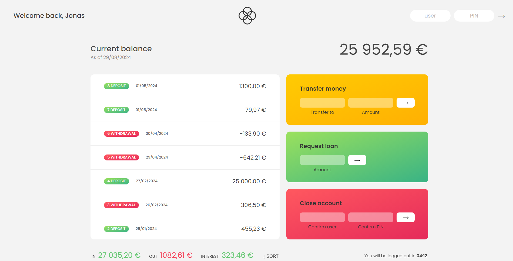

# Bankist

## Table of contents

- [Overview](#overview)
  - [Screenshot](#screenshot)
  - [Links](#links)
- [My process](#my-process)
  - [Built with](#built-with)
  - [What I learned](#what-i-learned)
  - [Continued development](#continued-development)
- [Author](#author)

## Overview

Bankist is a website for a fictional bank that has all the features you expect an online bank website to have including:

- The ability of users to be able to log into their accounts.

- The ability to transfer money from a user to another.

- The ability to ask the bank for a loan.

- The ability for a user to close their account at any time.

- Nice looking UI that clearly shows the balance, a detailed list of the transactions indicating whether each transaction is a deposit or a withdrawal and the date the transaction took place,and finally a summary of the inputs,outputs, and interest of the account so far.

- The ability to sort the transactions based on amount.

- Clear error handling messages for when a user runs into trouble, with easy to understand ways to rectify the problem.

This project is largely based on the "The Complete JavaScript Course 2023: From Zero to Expert!" by Jonas Schmedtmann on Udemy.

### Screenshot

### Links

- Live Site URL: (https://safensound95.github.io/bankist/)

## My process

### Built with

- HTML5
- CSS
- Flexbox
- CSS Grid

### What I learned

Really fun project, and extremely useful both for learning and as a standalone website ready to be used.
used a lot of the language's features especially Lots of array methods. at this point it's engraved in my brain with how much I've used in them in this project, they are truly such incredible tools and mastering them felt fantastic.

### Continued development

I want to make this fullstack in the near future, so I'll definitely be returning to it as soon as I'm more comfortable with the backend side of things.

## Author

- Frontend Mentor - [@SafeNSound95](https://www.frontendmentor.io/profile/SafeNSound95)
- Codewars - [@SafeNSound95](https://www.codewars.com/users/SafeNSound95)
- Exercism - [@SafeNSound95](https://exercism.org/profiles/SafeNSound95)
